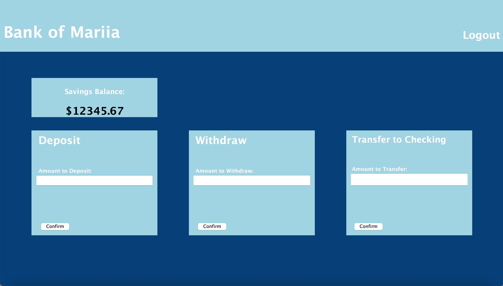
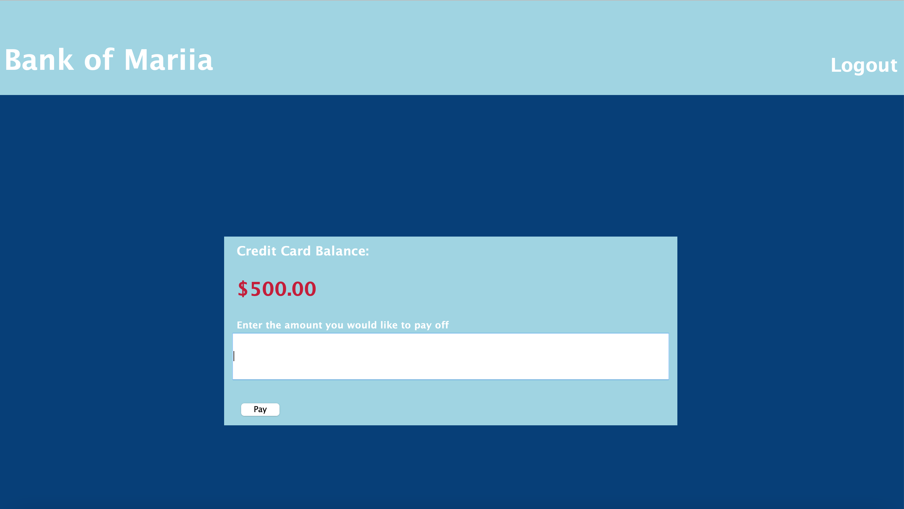

# CS151 Term Project- Banking App :moneybag:
Contributers: Abey John, Constantin Khamis, Hitayshi Shah, Sunny Chen

## Getting Started with Git & GitHub
### Installing Git and Planning Your Environment
1. Start by forking the repo (top right of the page). This will create a copy of the main repository on your GitHub account. 
You can find this respository by navigating to your own GitHub page. This forked repo will be your main repo for you to develop on this project. 
To merge your updates into the main branch, simply create a pull request via your forked repo. This will allow the project managers to review your submitted code before it merges into the main project repository.
2. Install the desktop git client if you do not have it already ([Git Download](https://git-scm.com/downloads) or `sudo apt install git` on Ubuntu). You can see if your git is working properly by simply typing `git` in your terminal (Git bash/MinGW on Windows)
3. Choose the folder/directory where you would like to work in (where your local repo will be stored). You can do this by typing `cd YOUR_PREFERRED_DIRECTORY` in your terminal
4. Now that you are in your preferred working directory, clone your forked repo by running `git clone https://github.com/YOUR_GITHUB_USERNAME/banking-app` in your terminal.

### Fetching the Latest Main Repo Updates
To be able to pull the latest updates from the main project repository into your local directory, run `git remote add upstream https://github.com/sjsu-tt-delta/delta-app.git`.  
**Every time you want to pull the latest updates from the main project repository, run `git pull upstream main`.**

## Project Overview
Our banking app was created using the Java Swing library and an MVC pattern with event driven programming. The application allows for multiple users. Each user has their own account and have different bank accounts such as checkings and savings. The user is able to withdraw, deposit, and transfer to and from each account. In addition, the user has a Credit account where they can view thier credit card balance and pay off their credit card bill.
## Login Page
This page allows the user to login or create an  account.

## Home Page
Once the user logs in or creates account, they are prompted to the home page where they can see an overview of all of thier accounts. Under each account, there is a details button that once clicked, will lead you to the respective pages.

## Checkings Account Page
The checkings account page allows for the user to deposit or withdraw from their checkings account. In addition, the user can transfer money from the checkings account to the savings account.

## Savings Account Page
The savings account page allows for the user to deposit or withdraw from their savings account. In addition, the user can transfer money from the savings account to the checkings account.

## Credit Card Account Page
The credit card page is where the user can see their credit card balance. They have the option to pay off the balance by entering an amount to pay off. 

